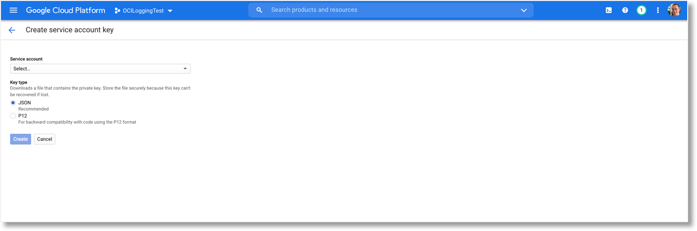
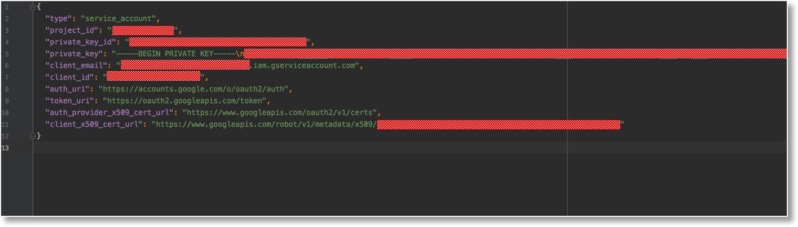

# OCI Cloud Events towards Google Cloud Platform Logging
The ociCloudEvents2GcpLogging integration function is part of the OCI Forward Functions Project project and is used to integrate Oracle Cloud and Google Cloud Platform Logging by leveraging the Google APIs to send OCI Event Data to Google Logging via an OCI Function.  

## Deployment
The deployment of this specific function is a standard deployment which is described in the deployment section of the standard documentation for this project. No deviations from the standard apply for this. 

## Configuration
To be able to configure the integration you will need some information from Google. For the integration to work you will
need to have a Google Service Account Key which in effect is a JSON object holding a number of key/value pairs
The information from the key/value pairs need to be used in Oracle Cloud to configure the integration. 

To generate a Google Service Key Account Key File take the following steps:
* In the Cloud Console, go to the Create service account key page.
* From the Service account list, select New service account.
* In the Service account name field, enter a name.
* In the Service account name field, enter a name.
* Click Create. A JSON file that contains your key downloads to your computer.

*Generate a Google Service Account Key*

*Note: The Role field affects which resources your service account can access in your project. You can revoke these roles or grant additional roles later. In production environments, do not grant the Owner, Editor, or Viewer roles.*

The below details need to be extracted from the JSON file that form the Google Service Account Key. By default
a number of the details will be pre-populated when deploying the function. They can be changed and are only 
present to make the configuration more smooth. 

*Google Service Account Key file content*

...............

## Viewing OCI events in Google Cloud Platform
.....................

## Additional information
* [Azure HTTP Data Collector API](https://docs.microsoft.com/en-us/azure/azure-monitor/platform/data-collector-api)
