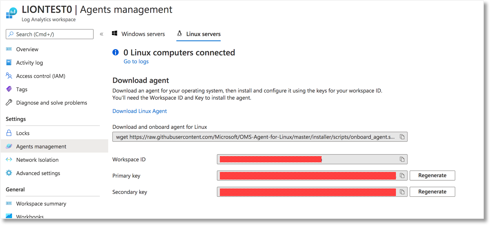
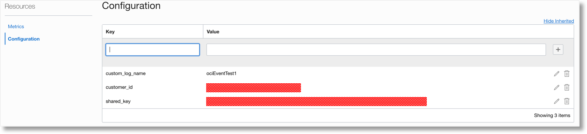
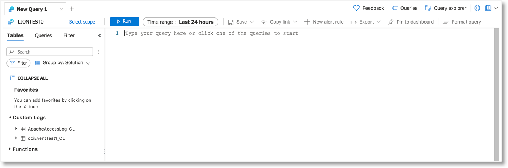
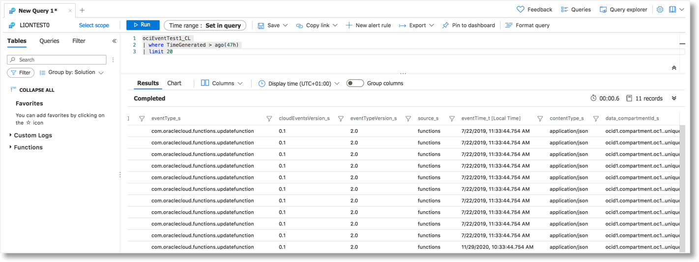

# OCI Cloud Events towards MS Azure Sentinel
The ociCloudEvents2azureSentinel integration function is used to integrate Oracle Cloud and Microsft Azure Sentinel by leveraging the Azure HTTP Data Collector API to send log data to Azure Monitor from a REST API client. It has to be noted that, after an event is posted to the Azure API it takes Azure at the moment around two minutes to process data in the background before it is shown in your workspace. 

## Deployment
The deployment of this specific function is a standard deployment which is described in the deployment section of the standard documentation for this project. No deviations from the standard apply for this. 

## Configuration
To be able to configure the integration you will need some information from Azure. For the integration to work the "workspace ID" and the "primary Key" (or secondary key) are needed. Those can be retreived via the "Agent Management" settings in your Log Analytics Workspace in Micrsoft Azure. The below screenshot shows where the information can be retrieved. 

To trigger the function within OCI to ensure the Cloud Event is send to the target requires the configuration of an OCI Event Rule and define this trigger as the specific action to be taken for matching events. This will allow you to only send the events you want to the function and by doing send it to the target of the integration. More information on the configuration of event rules and and actions can be located in the Oracle Cloud documentation and in the main documentation section for this project. 

*Aquire Azure details for Oracle Cloud Configuration*

Within Oracle Cloud the details retrieved from Azure needs to be added to the configuration of the specific function. When opening the ociCloudEvents2azureSentinel details in the Oracle Cloud UI you can find the default parameters that need to be configured

*Oracle Cloud function configuration*

* custom_log_name = The name of the custom log you want to upload the OCI Cloud Events towards
* customer_id = The Azure Workspace ID
* shared_key = The Azure workspace primary key or the Azure workspace secondary key

## Viewing OCI events in Azure
When data is send to Azure you can retrieve the data in your Azure workspace. It has to be noted that, after an event is posted to the Azure API it takes Azure at the moment around two minutes to process data in the background before it is shown in your workspace. The data that is provided to Azure will be stored in a custom log named after the value for custom_log_name which you configured in OCI for this function. Azure will append CL after the name configure in custom_log_name. The below example shows a custom log configured as ociEventTest1 as a custom log in your Azure workspace.

*Custom log with Oracle Cloud Events*

Retrieving and viewing OCI Cloud Events from Oracle Cloud in an Azure workspace can be done by creating a query in Azure and/or using any of the native Azure ways of retrieving data stored in a specific workspace. The below screenshot shows a simple retrievale query. The data shown in the screenshot is data based upon the [test data JSON file](../testdata/example_0.json) which is part of this github Repository.

*Query Microsoft Azure for Oracle Cloud Events*

## Additional information
* [Azure HTTP Data Collector API](https://docs.microsoft.com/en-us/azure/azure-monitor/platform/data-collector-api)
